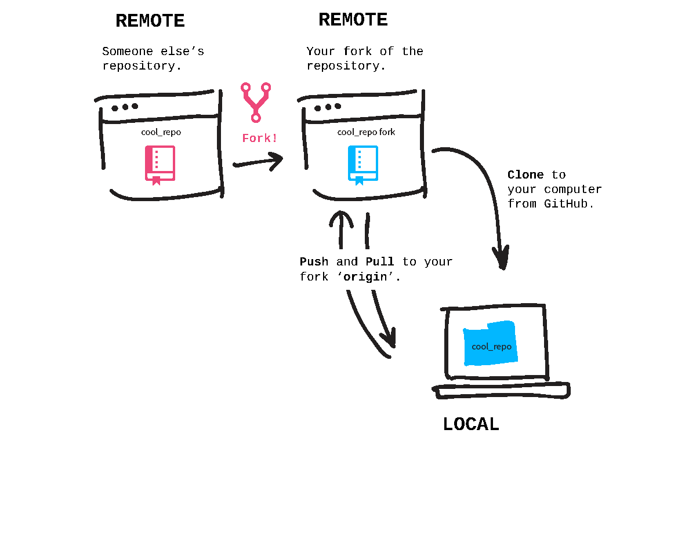

# Forks and Clones

So far you have made a project locally and pushed it to GitHub, but that's only half the fun! The other half is working with other people and other projects.

When you fork a repository, you're creating a copy of it on your GitHub account. Your forked copy begins its life as a remote repository, it exists just on your GitHub account, not on your computer. Forks are used for creating your own version of a project (this diversion from the original is like taking a fork in the road) or contributing back your changes (such as bug fixes or new features) to the original project.

To get a forked repository from your GitHub account onto your computer you clone it. This cloning action copies the remote repository onto your computer so that you can work on it locally.



## Fork a Repository

The project we'll work with is [cool-repo](https://github.com/Tim-Jackins/cool-repo). Go to that page and click the 'Fork' button at the top right. Once the forking animation is complete, you have a copy on your account. Copy your fork's HTTPS URL from the address bar in your browser, this is the address of your fork on GitHub's servers.

### Clone Your Fork Locally

Now, in terminal, you'll clone the repository onto your computer. It will automatically create a new folder for the repository so there is no need to create one yourself. But make sure you aren't cloning it inside of another Git repository folder!

So be sure you're not inside of the 'hello-world' directory from the previous challenges. To back out and leave this folder so that you can clone, follow these steps:

Back out of your 'hello-world' folder:
Tip: the two dots mean step out of a directory one level

```bash
cd ..
```

Now that you're no longer in another Git repository, clone your fork:

```bash
git clone <URLFROMGITHUB>
```

Go into the folder it created for your local copy of the fork (in this case, named 'cool-repo').

```bash
cd cool-repo
```

Now you've got a copy of the repository on your computer and it is automatically connected to the remote repository (your forked copy) on your GitHub account. Type git remote -v to see that the address to the fork is already set up.

## Connect to the Original Repository

What if the original repository you forked happens to change? You'll want to be able to pull in those changes too. So let's add another remote connection, this time to the [original](https://github.com/chssigma/cool-repo) repository with its URL.

You can name this remote connection anything you want, but typically people use the name 'upstream'; let's use that for this.

```bash
git remote add upstream https://github.com/chssigma/cool-repo
```

To be sure you have the correct remotes set up, type git remote -v to list out the addresses you have stored. You should have an 'origin' remote with your fork's address and then an 'upstream' remote with the address to the original, the URL noted above in this step.

>Show that your remotes are configured correctly to move on

### Handy Tips

Add a remote

```bash
git remote add <REMOTENAME> <URL>
```

Change a remote URL

```bash
git remote set-url <REMOTENAME> <URL>
```

View remote connections

```bash
git remote -v
```
